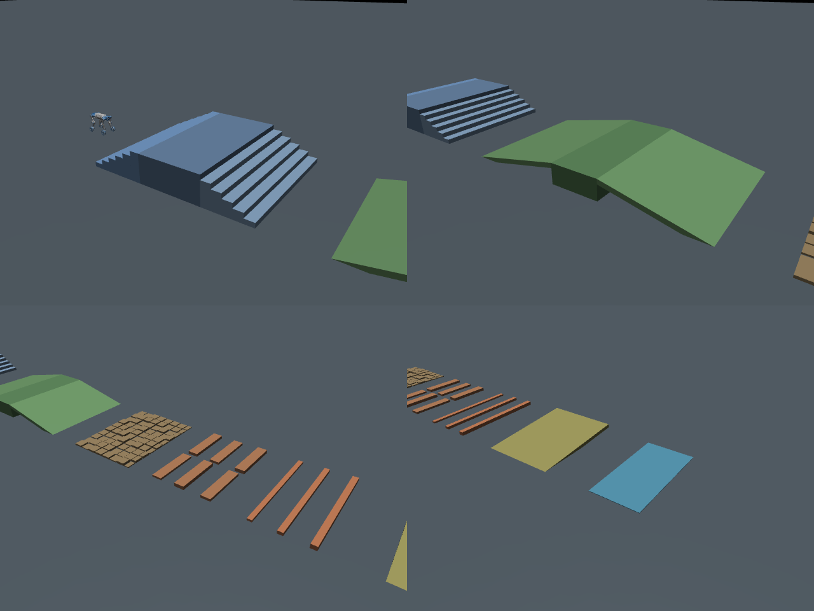

# 全地形 MuJoCo 测试路线

新增地形：[all_terrain.xml](../../deploy/deploy_mujoco/terrains/all_terrain.xml)。
该文件为完整原生静态地形 MJCF，不含机器人或外部资产。默认路线沿世界 +X，
各段坐标、实际尺寸、坡角、阶高、摩擦和调参公式均直接写在 XML 中。

## 路线与使用

平地起步 → 上楼 → 顶部平台 → 下楼 → 上坡 → 坡顶平台 → 下坡 →
粗糙方块 → 错位方块障碍 → 连续障碍条 → 横坡 → 低摩擦区 → 终点平地。

各主要地形间有平地缓冲，可测试连续运动、停车再启动、转身、侧移及反向通过。
横坡入口/出口存在高度变化，属于横倾与台阶组合地形。粗糙方块固定，不模拟碎石运动。
路线外保留无限平地；绕开某段同样可以到终点，须结合实际轨迹判断是否通过每段。

```bash
conda activate m20_wzh
cd /home/ubuntu/cyq_shixi_projects/rl_training

python deploy/deploy_mujoco/deploy_mujoco.py \
  --model "/home/ubuntu/桌面/m20_1/M20_perception_Lidar_rl_2/M20_perception_Lidar_rl/deep_robotics_model/M20/mjcf/M20.xml" \
  --checkpoint logs/rsl_rl/deeprobotics_m20_stair_teacher/2026-10-06_22-06-56_stair_resume/model_156300.pt \
  --terrain-xml deploy/deploy_mujoco/terrains/all_terrain.xml \
  --viewer
```

权重可以替换；上述 checkpoint 是本次实际加载验证的续训权重。按 `Z` 起立、`C` 策略，
`W/S/A/D/Q/E` 控制速度与转向，`H` 切换高程扫描点，`Esc` 退出。

调参直接改对应段的 `geom`，然后重启。`pos` 为中心，`size` 为半尺寸，`quat` 为旋转。
楼梯和坡面修改需要同步相邻平台，公式见 XML。公共 `numeric` 只提供部署元数据，
不会改写原生几何；摩擦实际来源为命名 default 和局部覆盖。
不使用单类楼梯的 CLI 覆盖参数。默认部署脚本和所有原有地形文件保持一致。

## 地形预览



从左上起依次为楼梯、上下坡、粗糙与障碍、横坡与低摩擦区。
这是实际模型的静态离屏渲染，已查看；没有策略运动物理，不用于证明通关或步态质量。
预览关闭阴影以避免此前 OSMesa 阴影伪影，不改变碰撞体。

## 验证结果

- 原生 XML 单独编译和现有部署加载器编译均成功；107 个地形碰撞几何。
- 机器人质量、关节/执行器顺序及状态维度与原模型相同。地面仅一张，碰撞地形属于扫描 group 0。
- 各段代表点的独立解析高度与碰撞射线结果一致；包括阶面、平台、坡面、粗糙块、
  左右错位障碍、横坡两侧以及低摩擦薄板。平面高度不能满足这些抬高表面的正对照。
- 36 个位置/朝向的 187 点扫描与独立解析表面对照，最大高度误差约 1.2e-9 米；
  Actor 的高度定义仍为 `clip(base_z-ground_z-0.5, -1, 1)`。
- 低摩擦板使用更高接触 priority，当前 M20 与该板实际接触的滑动摩擦系数为 0.5，
  验证了接触求解结果，没有仅检查 XML 参数。
- 使用上方固定机器人路径及 `model_156300.pt`，真实部署入口执行 50 个策略步、
  200 个物理步；244 维输入、16 维动作均有限，起步平地短回放未跌倒。
- 原有 XML、部署程序、加载器及 teacher 配置的 SHA256 与开工前相同。

数据见 [checks.json](checks.json)、[entry_smoke.npz](entry_smoke.npz) 和 [entry_smoke_summary.json](entry_smoke_summary.json)。
数值探针、冻结判据、资源记录、完整日志及开工前哈希保存在 `.scratch/all_terrain_20261007/`。
检查使用 m20_wzh，单 CPU 线程、CPU 推理及 OSMesa，无 GPU 训练，文件总量小于 1MiB。
内存预算依据是此前同加载器的 CPU 检查与少量静态几何，开跑前整机可用内存约 101GB；
单个子进程最多运行 90 秒，未设置服务级 MemoryMax，未采集资源峰值。

只做场景、感知和短时部署检查，没有整条路线的任务完成率、步态、反向穿越或真机测试。
没有启动或修改训练，也没有测试本次新场景中的物理键盘操作。

## 经验

**现象**：需要在同一 MuJoCo 场景中切换多种地形并测试连续过渡。

**原因**：单类场景和短混合场景覆盖有限；摩擦的 XML 值还可能被机器人侧默认接触规则覆盖。

**判据**：原生几何可加载，真实扫描读到每段表面，机器人 ABI 不变；摩擦检查实际 contact 系数。

**修法**：独立原生综合 XML，按段标注位置/尺寸/旋转/摩擦，保留缓冲区；局部低摩擦板设置
更高 priority 并用真实机器人接触验证，原有场景和控制程序保留。

经验条目已写回共享知识库本地。同步前 `git fetch hub main` 因既有 Git 松散对象损坏、
缺少所需 commit 而失败，未提交或推送，也未修改共享仓库的其他文件。
