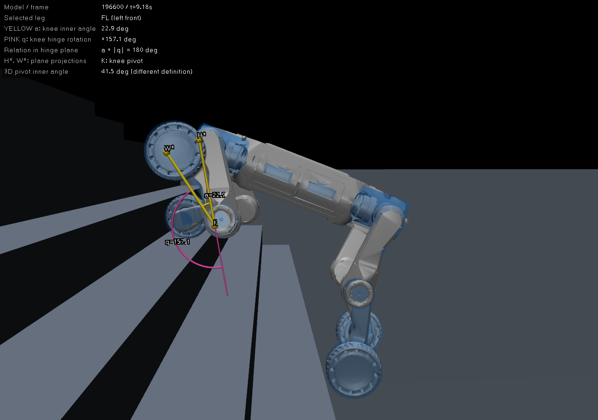
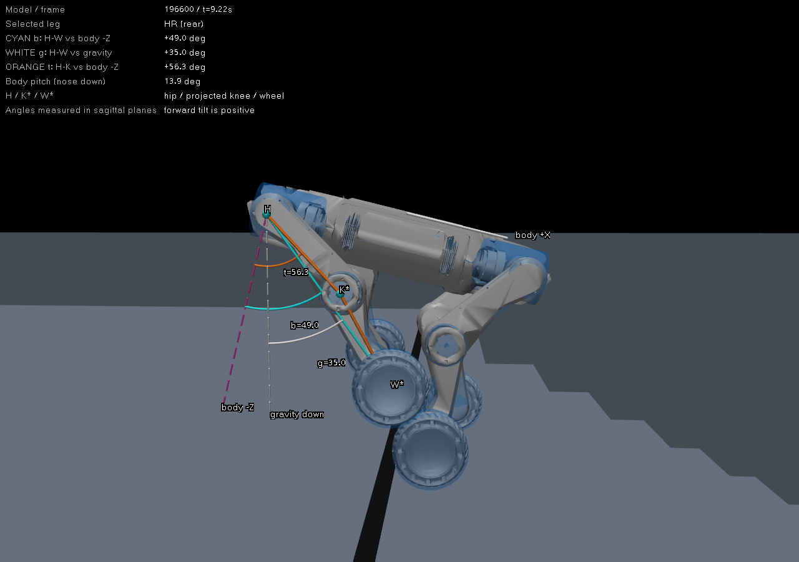

# 姿态夹角定义对齐：实际 MuJoCo 窗口截图

本轮重新实际运行固定 `model_196600.pt`，与上一轮评测保持同一权重。使用原部署FSM趴下→Z起立→C策略→W前进，200Hz物理、50Hz控制，速度0.5m/s，8个15cm台阶；上楼踏深20cm，下楼踏深30cm。

截图来自本进程的官方 `mujoco.viewer.launch_passive` X11窗口，截取时暂停继续推进物理。角度线、圆弧、参考方向和文字直接在MuJoCo的 `user_scn/set_texts` 中绘制，未通过图像编辑生成姿态；没有用旧qpos回放替代闭环。训练、奖励、原部署源码均未修改。截图里都是单帧角度，不是上一轮的P95统计值。

## 1. 上楼：左前腿膝部

标记：H为髋关节中心，K为膝关节中心，W为轮心。H*和W*是将对应点投影到膝关节运动平面后的点；标线为了可见沿关节轴平移到机器人表面外，不改变夹角。

| 截图角标 | 定义 | 这一帧 |
| --- | --- | ---: |
| 黄色 a | 膝内夹角，K→H*与K→W*之间的夹角 | 22.9° |
| 粉色 q | 膝关节从模型零位转过的角度；圆弧从大腿向下延长线量至小腿 | +157.1° |

在当前模型与运动平面中，`a + |q| = 180°`。膝越折，a越小、|q|越大。**此前报告的157°对应q，并不是两段腿之间的内夹角a。**

M20髋→膝、膝→轮心包含侧向偏移，因此直接用三个原始3D关节中心算出的∠HKW为41.5°；它与投影到关节运动平面的22.9°也是不同的定义。不能用手机量截图像素的角度替代关节数据，观察方向和投影也会产生偏差。

我的“前腿深折”理解：黄色a很小，轮心向髋关节附近收起。若用户指的是大腿相对机身的方向，则应另行约束髋关节/大腿姿态。

## 2. 下楼入口：右后腿向前倾

这里“前”由图中的机身 `+X` 箭头定义。粉色虚线为机身向下 `-Z`，白色虚线为重力向下；两者因机身俯仰而不同。K*/W*为用于画侧向角度的矢状面投影点。

| 截图角标 | 定义 | 这一帧 |
| --- | --- | ---: |
| 青色 b | 髋→轮心连线，相对机身向下方向的前倾角 | +49.0° |
| 白色 g | 髋→轮心连线，相对重力向下方向的前倾角 | +35.0° |
| 橙色 t | 髋→膝的大腿方向，相对机身向下方向的前倾角 | +56.3° |

b与t投影到机身X-Z平面计算；g投影到世界竖直及机器人偏航前向构成的平面计算。三者都约定向前为正。机身自身在这一帧约向下俯倾13.9°；本次没有把机身姿态当作后腿关节弯曲。

我的“后腿前倾”理解主要对应青色b：轮心相对髋关节向机器人前方伸出。橙色t只描述大腿；两者对应的奖励设计并不相同。该帧后膝的关节转角绝对值仅14.4°，说明“整腿向前伸”和“膝折叠过大”可以是两种独立问题。

## 数值、工具与自检

- 原始角度、真实H/K/W坐标见 [up_angles.json](up_angles.json)、[down_angles.json](down_angles.json)；截图时刻的物理状态另存于 `up_state.npz/down_state.npz`。
- 临时脚本在 `.scratch/angle_alignment_20261007/capture.py`，只有显示和测量补丁，没有奖励或策略改动。
- `mj_step` 在求解之后积分qpos。截图测角前通过 `mj_kinematics` 刷新同一qpos的关节位置，避免把前一物理步的几何和当前关节值拼在一起；没有修改或重新摆放qpos。
- 两帧均验证投影内夹角与原始关节转角互补，测量原语以直腿180°、直角90°、垂直倾角0°、向前倾45°作数值对照；原控制/训练文件哈希不变。
- 捕获窗口通过 `_NET_WM_PID` 核对为当前进程，只截MuJoCo窗口，不捕获整张桌面。两张最终图已查看，标线和关节可见；为了近侧腿不被另一侧遮挡调整了相机视角。
- 初次截图发现几何时刻与qpos相差一个物理步，以及观察视角遮挡标线；更正测量刷新与近侧相机后重新运行两场景。最终交付为重跑后的截图。
- 这轮用于对齐角度定义，未修改奖励，未进行新的策略性能或实机评估。
