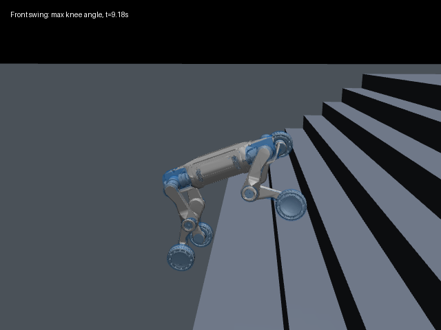
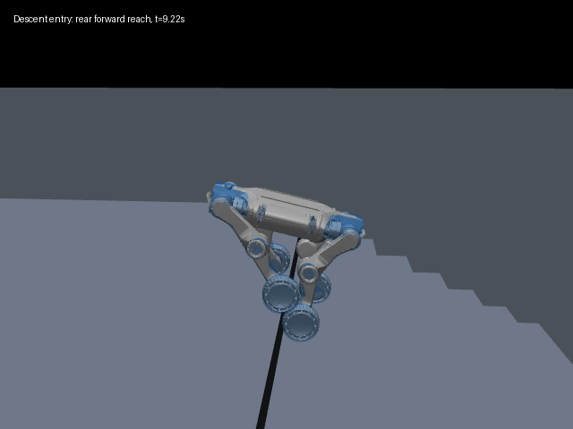
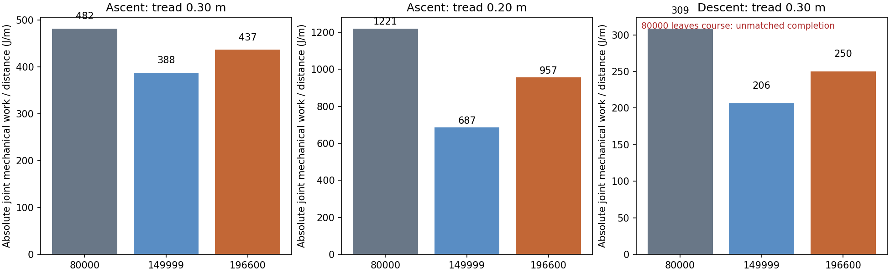
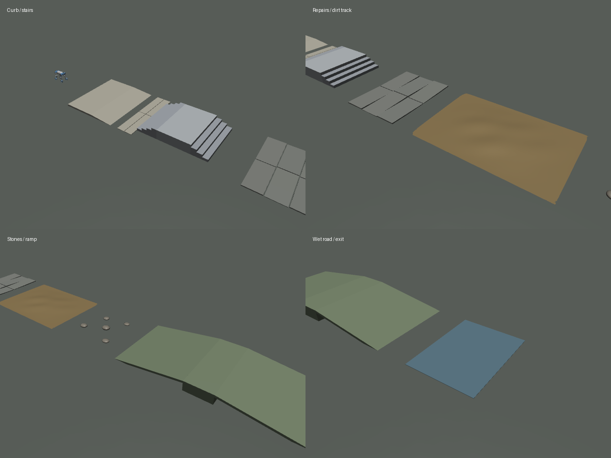

# M20 最新步态、接触力与节能评测（2026-10-07）

## 结论

最新冻结的 `196600` 模型完成了本次三种短楼梯测试，但尚未达到前后腿逐阶换侧、另一只腿不再跟上同阶的目标。窄踏面时前腿有深度折叠；下楼入口后腿前伸明显，却不是本次测量中的严重膝折叠。机械耗能相比早期模型有改善，接触冲击没有全面下降，较中间模型的单位距离耗能还有回退。

新增真实园区表面近似地形：[`realistic_outdoor.xml`](../../deploy/deploy_mujoco/terrains/realistic_outdoor.xml)。本轮只新增地形及评测记录，控制、Actor、奖励函数、训练配置、pre_teacher 的冻结文件哈希均未变化。

## 参照物与方法

| 名称 | 原始权重 |
| --- | --- |
| 早期参照 | `logs/rsl_rl/deeprobotics_m20_stair_teacher/2026-10-02_00-12-17/model_80000.pt` |
| 中间参照 | `logs/rsl_rl/deeprobotics_m20_stair_teacher/2026-10-03_15-12-45_gait_resume/model_149999.pt` |
| 本轮最新 | `logs/rsl_rl/deeprobotics_m20_stair_teacher/2026-10-06_22-06-56_stair_resume/model_196600.pt` |

“最初”尚未收到用户进一步指定，采用已有、步态修正之前的 80000 权重。历史 2026-09-29 目录未在本项目找到，因此不能声称已经比较了该次最初训练。训练仍在更新，“最新”指本轮开始时冻结的 196600，不滚动更换参照物。SHA256 见 [checkpoints.json](checkpoints.json)。

机器人固定为部署文档中的 M20.xml。三组条件均为 8 个 15cm 台阶、纵向命令 0.5m/s；上楼踏深 30cm、20cm，下楼踏深 30cm。每个模型每种条件实际跑一次，共 9 次。测试使用原部署 FSM：趴下→Z起立→C策略→W前进；无头显示和脚本按键替代人工操作，未更改物理、PD、观测或策略。

200Hz 记录真实 MuJoCo 轮足接触合力及关节力矩/速度，50Hz 记录关节、支撑状态与落阶事件。结束条件为四轮均越过台阶终点并在路线宽度内，或离开路线、跌倒、时间上限。能耗段从前轮接近楼梯开始，到四轮完成之前；排除策略刚启动和完成之后的区段。静止阶段四轮竖直合力约 339N，与模型重力一致，比例误差小于预设15%界限。

机械耗能定义为 `Σ|τ_j·q̇_j|` 的时间积分；单位距离耗能除以实测纵向位移。它不等于电池耗能，未计驱动器效率、铜耗和电气回馈。接触力统计池为四轮中合力模长>5N的样本，包含水平撞阶力，不能和只统计竖直力的旧结果混用。

判据在执行前冻结，见 [criteria.md](criteria.md)。逐模型数据、停止原因、完整落阶事件均保存于各模型/条件的 `summary.json`，原始轨迹见同目录 `telemetry.npz`、`physics.npz`。

## 1. 前腿上楼折叠

| 最新模型 | 稳定支撑膝角P95 | 摆动膝角P95 / 最大 | 摆动髋至轮心最短距离 | 超出当前摆动包络比例 |
| --- | --- | --- | --- | --- |
| 踏深30cm | 92.0° | 132.4° / 135.1° | 0.248m | 0% |
| 踏深20cm | 97.3° | 144.1° / 157.1° | 0.185m | 5.8% |

膝角为实际膝关节位置的绝对值，不是人体习惯的膝内夹角。支撑要求连续稳定接触≥0.20s，摆动按轮足合力<5N判定；这些是本次离线测量定义，不冒充训练环境的每帧奖励门控。

当前 `ascent_front_fold_cost` 对稳定支撑和摆动使用不同包络：支撑最短0.35m、膝角2rad；摆动最短0.22m、膝角2.5rad，摆动惩罚再乘0.5。宽踏面的明显折腿主要在摆动阶段，仍处于允许包络，不能简单归因于“奖励没接上”。窄踏面确有超包络的短时深折叠，且记录到右前腿非轮部件碰阶，峰值175N；宽踏面没有非轮碰撞。



应优先核对“跨阶所需最低抬升/净空”与膝折叠的关系，再逐渐收紧超出净空需求的摆动折叠，保留落地柔顺时间。全面压低膝角可能让策略撞立面、回退或失去窄踏面通行能力。该建议尚未实施、未通过改后对照验证。

## 2. 下楼入口后腿前倾

最新模型入口段：第一前轮开始下台阶约8.54s，第一后轮约9.24s；测量窗口至10.24s。

- 稳定支撑后腿的髋→轮心向前倾角P95：机身坐标约35.4°，仅消除偏航后的重力坐标约23.0°。
- 髋→轮心在机身前向最大分量约0.318m，机身向下俯倾最大约25.4°。
- 后腿稳定支撑膝角P95约69.3°、最大82.8°；髋→轮心最短0.409m，未进入当前严重折叠包络。
- 本次最新下楼未记录非轮部件碰地/碰阶。

因此，用户看到的后腿向前伸确实存在，但当前 `descent_rear_fold_cost` 只管腿长度/膝角，不能直接纠正前后方向的姿态。机身俯倾也会改变视觉和机身坐标倾角，需要同时看重力坐标和机身坐标。不能把这两个角度的P95之差直接当作对应帧的机身俯仰角。



后续可增加仅作用于“进入下楼且后腿稳定支撑”的前向伸展超量成本；目标应随局部落差、支撑位置和速度调整，允许正常前伸制动与跨阶，不能要求所有后腿始终竖直。具体安全包络需要额外参数扫描和改后对照，当前结果不足以给出唯一最佳角度阈值。

## 3. 前后腿是否严格交替

**还没有。** 检查按每只腿在每个物理台阶首次稳定着地记录，保留另一只腿稍后落到同阶的事件。稳定着地持续≥0.06s；排除地面和楼顶平台，排除同腿弹跳重复事件。

宽踏面最新前腿实际序列：

```text
FL1 → FR1 → FL2 → FR2 → FL3 → FR3 → … → FL7 → FR7
```

后腿实际序列：

```text
HL1 → HR1 → HL2 → HR2 → HL3 → HR3 → … → HL7 → HR7
```

前、后腿各有7次相邻落地事件在同阶；前、后腿各只有6/13个相邻事件满足“换侧且台阶编号+1”。46.2%是局部事件匹配比例，**不是严格交替步态成功率**。窄踏面前腿4/9、后腿4/13，同时出现同腿连上不同阶、漏阶、同阶跟随。

代码检查：上楼完成账本在第一个轮足落地后就退休当前目标，切换下一目标；已有同阶成本通过“两轮同时接触且同高”等条件识别，停留成本还允许短暂支撑转移。它能惩罚部分同时同阶支撑，但不能保证抓到所有“第一腿已经离开、第二腿才来到同阶”的事件。因此低同阶曲线不足以证明达到本项目的时序要求。

后续优先把每个物理阶的前/后轴首次落地历史用于约束后来的跟随落地，并明确区分中间台阶、顶平台、转向/反向指令。若只强化现有同时支撑成本，可能诱导缩短同时接触，而没有真正改掉同阶跟随。本轮未修改账本。

## 4. 接触力与机械耗能

### 上楼：任务完成条件可匹配

| 条件 / 模型 | 接触力P95 N | P99 N | 峰值 N | 平均机械功率 W | 单位距离机械耗能 J/m |
| --- | ---: | ---: | ---: | ---: | ---: |
| 30cm / 80000 | 324 | 516 | 1383 | 279 | 482 |
| 30cm / 149999 | 298 | 443 | 1472 | 232 | 388 |
| 30cm / 196600 | 274 | 395 | 1464 | 227 | 437 |
| 20cm / 80000 | 333 | 482 | 1226 | 318 | 1221 |
| 20cm / 149999 | 341 | 552 | 1663 | 305 | 687 |
| 20cm / 196600 | 330 | 653 | 1794 | 308 | 957 |

最新相比80000：宽踏面P95下降15.4%、P99下降23.4%，峰值却上升5.8%，单位距离耗能下降9.4%；窄踏面P99上升35.3%、峰值上升46.4%，单位距离耗能下降21.6%。**没有达到接触力全面下降。** 相比149999，最新两种上楼单位距离耗能分别增加12.7%、39.5%，平均功率下降不能掩盖通过时间/距离效率的退步。

50ms落地后合力模长积分另存于 `analysis.json`：接触须在至少20ms无接触后建立，完整50ms窗口须落在评测区段。宽踏面P95由19.33降到18.50N·s；窄踏面由17.69升到20.13N·s，同样没有一致降低。这包含支撑载荷和立面接触，不称作纯碰撞冲量。

### 下楼：早期参照未完成

80000模型下楼离开路线，不能用它未完成任务的耗能作为同等任务效率参照。149999、196600均完成：P99由591降到444N、峰值由2111降到1526N；但P95由196升到214N、单位距离耗能由206升到250J/m（增加21.1%）。下降大冲击与提高效率这两个目标需分别评估。



## 5. 节能奖励是否运作

CRC校验后读取训练 TensorBoard 事件，截断到各冻结checkpoint对应迭代，取最后500条标量；不把继续训练产生的未来日志混入当前权重分析。摘要见 [tensorboard_rewards.json](tensorboard_rewards.json)。

| 最新训练 Episode_Reward 标量 | 后500条均值 |
| --- | ---: |
| 线速度跟踪 | 4.5183 |
| 楼梯力矩成本 | -0.001914 |
| 楼梯关节加速度成本 | -0.004487 |
| 楼梯机械功率成本 | -0.000719 |
| 楼梯冲击成本 | -0.002043 |
| 上楼前腿折叠成本 | -0.000286 |
| 同阶停留成本 | -0.00000986 |

这些是环境记录的全地形episode加权回报标量，**不是单独楼梯阶段的瞬时奖励，也不能直接倒算接触力**。节能、冲击成本已接线且产生非零惩罚；无法据此证明节能改善由这些项造成，因为三个参照模型都已有节能项，没有关闭/开启奖励的消融。

潜在设计弱点：

1. 功率项对16关节先取均值再除以1800、权重-0.1。对总功率约300W、门控为1时，瞬时加权成本仅约-0.00104；若1800本意是整机总功率基准，当前均值操作会额外缩小16倍。应先明确总功率还是每关节尺度，再校准成本，不能只盲目放大权重。
2. 功率/力矩等只用当前scan的地形门控，和保持目标状态的非轮碰撞成本不同，可能在视野变平、后腿仍在阶上时减弱。这里只是代码推断，尚未重放真实Isaac门控轨迹验证。
3. 冲击项使用新接触时当前轮体下降速度；采样是在物理接触之后，可能已经制动，还不能覆盖水平撞立面。这是代码风险，不能把本次MuJoCo力峰值直接当作Isaac该项漏罚的证明。
4. 同阶/膝折叠曲线的低值也可能来自门控或包络定义；本次接触序列证实不能以低成本直接判断目标步态达成。

最新训练 `front_fold_support_fraction` 后500条均值约9.8%，高于中间模型约5.3%；训练全地形分布、课程难度不同，这提示仍有问题，不能作同地形改善/退步的因果证明。

## 6. 新户外测试地形



新XML按世界+X排列真实场景常见表面：路缘石/无障碍回落坡、混凝土接缝、建筑楼梯和平台及下楼、微倾斜修补板、连续起伏土路高度场、零散固定圆石、缓坡丘和潮湿路面的低抓地近似。坐标、尺寸、摩擦、台阶/坡面计算方式和调整方法全部在XML注释内；高度场数据嵌在XML，不依赖图片。

它模拟刚性表面：土不下陷、石块不移动、不模拟液体水膜。路线外保留平地，须看实际轨迹防绕行；终点越线不等于各段都通过。原生几何的 `pos/size/quat/friction` 或命名default才是实际参数，公共custom/numeric不自动改写这些几何。

已验：单独编译、原部署terrain_loader加载、机器人质量和关节/动作ABI不变、仅一张地面；独立预期高度26点（含不对称高度场顶点）、28个位姿各187点高程与244维观测有限；湿区真实碰撞接触摩擦0.45；原部署入口50步/200物理步完成，无跌倒。详见 [outdoor/checks.json](outdoor/checks.json)。**未跑完出生X=-1到终点X=44的全路线，未测试本轮GUI键盘路径，不据此声称全地形策略已经通过。**

```bash
conda activate m20_wzh
python deploy/deploy_mujoco/deploy_mujoco.py \
  --model "/home/ubuntu/桌面/m20_1/M20_perception_Lidar_rl_2/M20_perception_Lidar_rl/deep_robotics_model/M20/mjcf/M20.xml" \
  --checkpoint logs/rsl_rl/deeprobotics_m20_stair_teacher/2026-10-06_22-06-56_stair_resume/model_196600.pt \
  --terrain-xml deploy/deploy_mujoco/terrains/realistic_outdoor.xml \
  --viewer
```

趴下开始，Z起立，C策略；W/S/A/D/Q/E控制，H显示高程点。

## 交付与局限

- 原始测量、曲线摘要、对照数据、真实闭环视频、记录姿态重建截图均存本目录；综合数据见 [analysis.json](analysis.json)，关节与入口倾角图见 [gait_traces.png](gait_traces.png)。
- 本轮9个测试均正常执行结束，其中早期模型下楼离开路线，已计为未完成；其余8个完成。本轮不是重复样本成功率评估，未测20阶长楼梯、25cm阶高、不同速度、转向和真实机器人。
- 初次latest宽踏面试跑在物理完成后报告阶段发生NameError，修复临时测量脚本并重跑同条件；早期TensorBoard全量Accumulator读取超时，改为TFRecord索引及有CRC校验的限定尾段解析，才得到所列摘要。
- 高度场首次自检发现原生elevation编译会翻转行序；通过不对称顶点实测核对，并更正XML坐标注释。没有更改部署扫描代码。
- 下一轮建议顺序：先修物理阶的时序落地账本，再调前腿阶段包络与下楼后腿前伸，最后校准机械功率尺度及冲击代理；每次用本轮固定条件复测通行、姿态、冲击与耗能，避免一并改动后无法归因。
- 自检：临时测量/分析脚本pyflakes通过，冻结权重与8个控制/训练文件SHA256一致，报告链接均存在。company-rules可机检条款未发现问题，但全公司分发扫描有一个权限不可读目录及其他仓库跳过项，不能报告全局全绿。经验已写回该项目本地知识条目；共享知识仓库存在损坏Git对象，远端同步未完成，本轮不修改其他项目的仓库状态。
