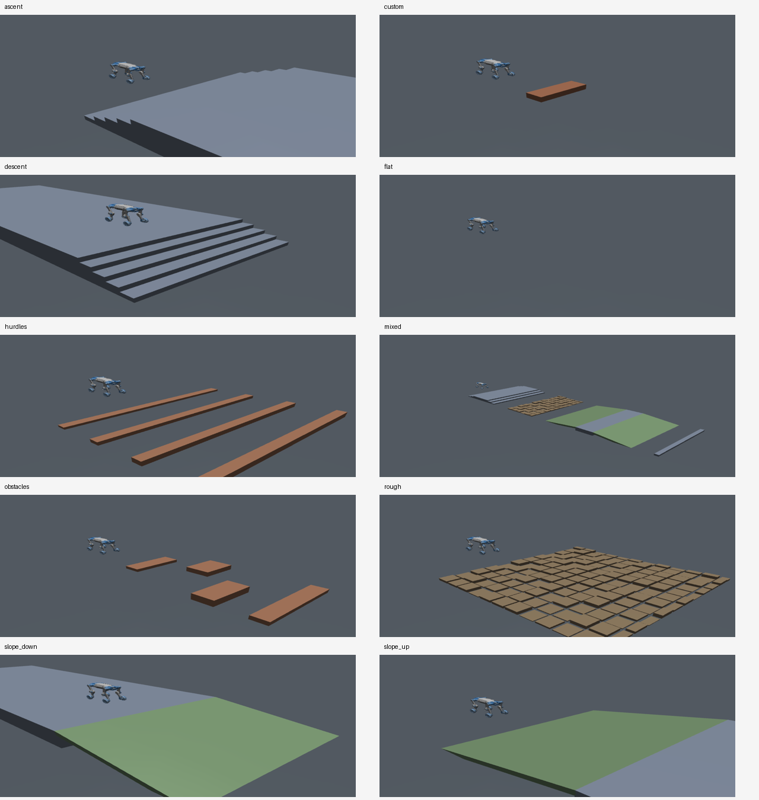

# 多地形 MuJoCo 部署检查

## 实现

- 部署入口：[deploy_mujoco.py](../../deploy/deploy_mujoco/deploy_mujoco.py)，通过 `--terrain-xml` 选择地形，原 `--terrain` 快捷名仍可用。
- XML 参数读取和实际碰撞体生成：[terrain_loader.py](../../deploy/deploy_mujoco/terrain_loader.py)。
- 地形文件和调参说明：[terrains/README_CN.md](../../deploy/deploy_mujoco/terrains/README_CN.md)。
- Actor 仍接收 57 维本体与 187 维高程，只加载 actor 参数；训练配置与 pre_teacher 未在本任务修改。



预览为离屏渲染的静态几何检查图；OSMesa 阴影存在三角伪影，预览关闭阴影，未改变碰撞体或部署窗口的渲染设置。

## 实测与范围

环境：`m20_wzh`，MuJoCo 3.10.0；机器人固定使用根 README 中的 M20.xml，具体完整路径及权重记录在 [checks.json](checks.json)。

本次检查使用单 CPU 线程，无训练；检查前机器可用内存约 106 GB。10 个地形依次运行，每个只做 50 个策略步、200 个物理步；数值检查和 OSMesa 渲染均在 CPU 上进行。截图、JSON 和短轨迹保存在当前目录，未运行长期评测。

| 检查 | 结果 |
| --- | --- |
| 9 个预设与 1 个原生 XML 示例 | 全部加载并编译，Actor 输入 244，输出 16；机器人关节顺序、质量保持一致 |
| 楼梯及坡面的 187 点扫描 | 正向与旋转网格逐点对照解析表面高度，误差在检查容差内 |
| 高度定义 | 米；输入为 `clip(base_z-ground_z-0.5, -1, 1)`，延续部署观测契约 |
| 改 XML 的楼梯级高 | 碰撞射线检测从 0.15 m 改为 0.25 m |
| 改 XML 的坡角 | 同一采样点高度从 0.318835 m 改为 0.545955 m |
| 摩擦参数 | 修改 XML 后地面与生成障碍的实际 `geom_friction` 同步变化 |
| 随机方块 | 固定种子重载，几何位置逐项相同 |
| 原生资产 | 独立只读复审验证 hfield 能 attach、碰撞高度射线检测正常 |
| 无效配置 | 零级高、NaN/Inf 命令行覆盖、下降出生点不在高平台内均被拒绝 |
| 旧楼梯命令行覆盖 | 实际级高、级数及终点随覆盖值改变 |
| 混合路线部署入口 | [mixed_smoke.npz](mixed_smoke.npz)：实际入口 50 个策略步，无跌倒、无非有限观测 |
| GUI 模式与按键回调 | [viewer_smoke.json](viewer_smoke.json)：窗口成功启动；注入 Z/C/W 回调，完成趴下→站起→ready→policy，共 350 步，未跌倒 |

GUI 测试通过程序注入同一按键回调验证状态机，未手工逐个测试物理键盘按键。离屏预览已人工查看。正式长回合全地形穿越能力**未评测**；短时冒烟不代表策略学会这些地形。越线字段也未检查绕行。

## 重跑数值与物理检查

在项目根目录、激活 `m20_wzh` 后：

```bash
OMP_NUM_THREADS=1 OPENBLAS_NUM_THREADS=1 MUJOCO_GL=osmesa \
python scripts/tools/check_mujoco_terrains.py \
  --checkpoint logs/rsl_rl/deeprobotics_m20_stair_teacher/2026-10-01_12-22-19/model_22400.pt \
  --output docs/mujoco_terrains/checks.json \
  --render-dir docs/mujoco_terrains/renders
```

`--model` 可覆盖固定参考机器人路径；省略 `--render-dir` 可只做数值与物理检查，不渲染。

## 复审与踩坑记录

完成自审及独立只读复审；可用 reviewer 与主执行者同属 Codex family，未获得其他模型家族的复审，不称为异构复审。复审发现的问题已修复并加入负对照：

1. **现象**：无穷 CLI 级高能进入编译，出现非有限几何。**真因**：只检查 XML 原值，覆盖值绕过检查。**判据**：覆盖 Inf/NaN 应立即抛出 ValueError。**修法**：覆盖入口和标量读取均检查有限性。
2. **现象**：缩短下降出生平台后机器人在底部出生。**真因**：射线正确返回底面，但没有检查出生点属于顶部平台。**判据**：平台不覆盖出生 XY 时拒绝启动。**修法**：下降预设增加出生位置检查，XML 说明需为机器人占地留余量。
3. **现象**：末帧越线可能被误当为完成障碍。**真因**：统计只检查位置与跌倒，未检查整条路线。**判据**：摘要必须明确绕行未检查。**修法**：新增 `clearance_criterion` 并在使用文档说明适用范围。

知识条目已随本地项目文档落盘；本轮未同步 Hub 知识库。

`company-rules check` 的项目可机检条款未发现问题；全机分发检查因 `~/.gnupg` 读取权限不足未完成，另有工具声明跳过的外部检出。本任务未修改这些目录或权限。
