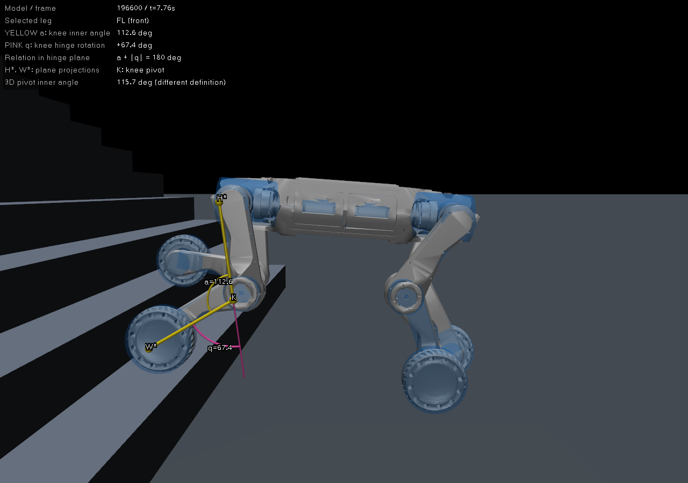
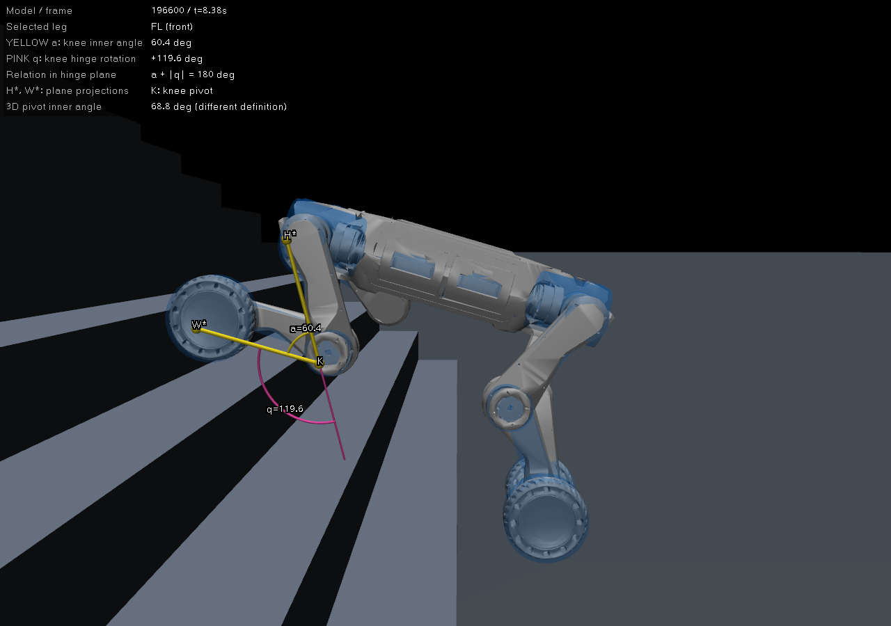
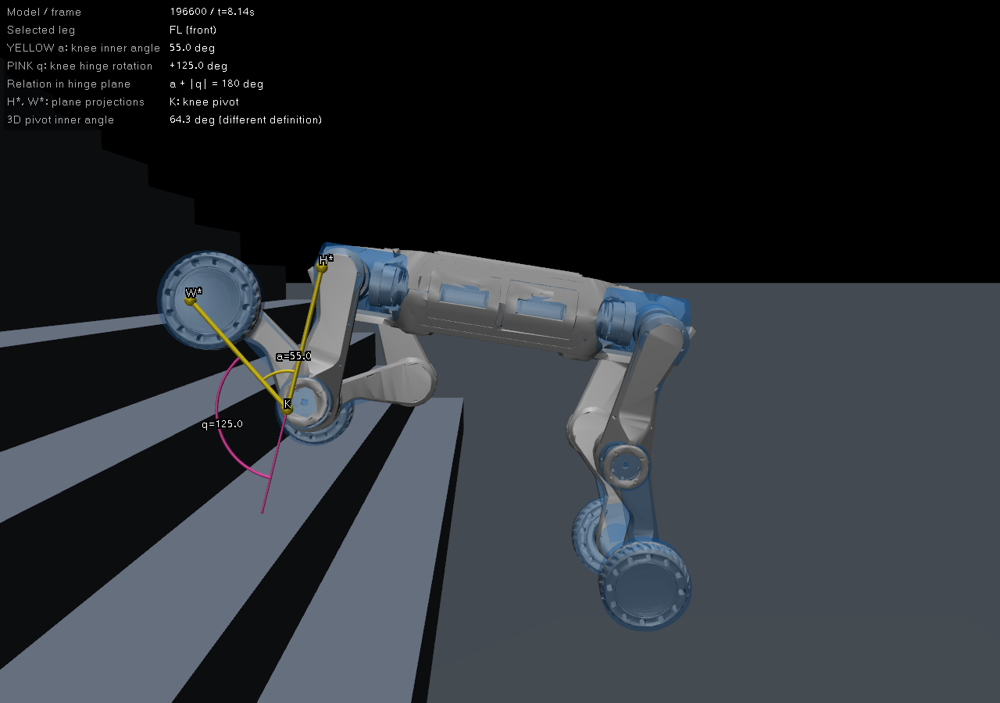
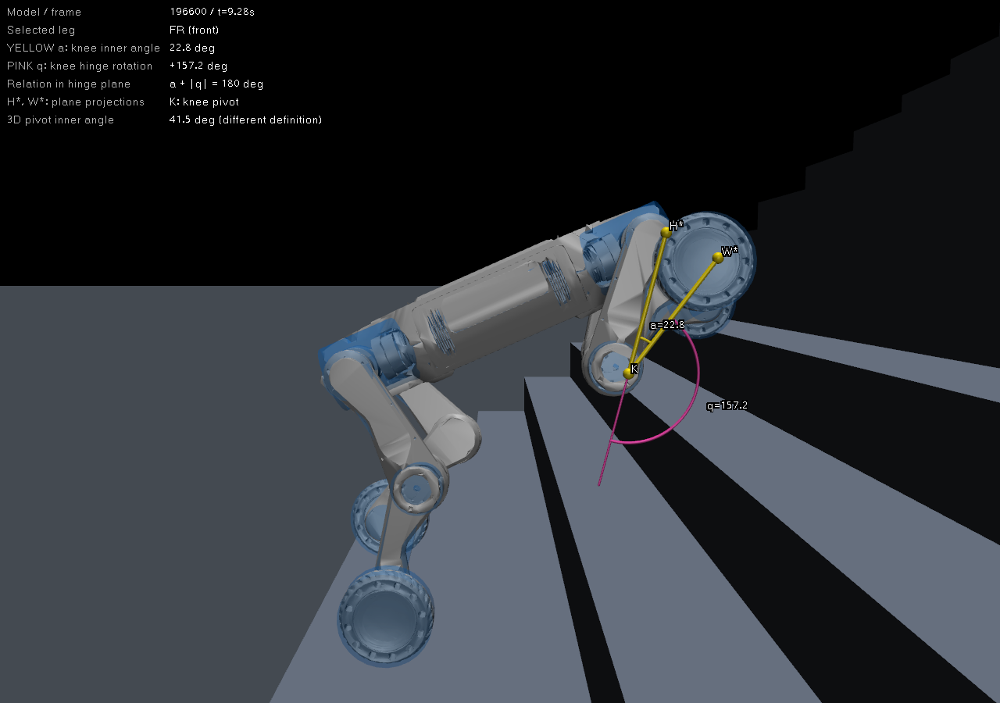

# 按原始 stairs_ascent.xml 对齐前腿姿态

用户指出此前极深折腿照片未在手动测试中见到，本轮直接加载项目的 `deploy/deploy_mujoco/terrains/stairs_ascent.xml`，没有阶高、踏深、数量或起点覆盖参数。仍使用上一轮固定的 `model_196600.pt`，原部署W速度0.7m/s。

## 运行条件与结果

实际加载摘要：20级、阶高0.15m、踏深0.20m、起点X=0.25、出生X=-1、宽4m，终点X=4.25；源XML哈希见 [summary.json](summary.json)。机器人模型与上一轮相同，Actor244→16，未使用Critic。原FSM趴下→Z起立→C策略→持续W；官方MuJoCo窗口、真实闭环物理、脚本重复W事件。模拟849个50Hz控制步，四轮越过终点且在路线内，无跌倒。本轮一次确定性完整运行，不代表多样本成功率。

此前图来自8级0.5m/s测试中的摆腿深折帧。本轮将稳定支撑、接触承载转换和摆动分开，不把某一极值截图当作整个步态。

## 1. 初期稳定支撑：内夹角112.6°

左前腿，t=7.76s：黄色膝内夹角a=112.6°，粉色关节转角q=67.4°。选帧条件为连续有效支撑≥0.20s，并位于正高度台阶。

## 2. 接触台阶、开始承载的转换帧：内夹角60.4°

左前腿，t=8.38s：a=60.4°、q=119.6°。该帧竖直接触力约61.2N，已开始接触承载，但连续有效接触仅0.02s，**不是已经站稳0.20s的姿态**。轮足接触也含水平分量，不称作纯竖直踏面支撑。选帧条件为竖直力>50N、>合力模长的一半、局部离地误差≤0.05m，并在中间台阶上。

这张照片用于对齐用户可能看到的“踏上台阶时前腿过弯”。它与抬腿最深折叠属于不同阶段。

## 3. 摆腿：内夹角55.0°，及较深折叠22.8°

左前腿，t=8.14s：a=55.0°、q=125.0°。

右前腿，t=9.28s：a=22.8°、q=157.2°。这种深折叠在本轮原XML/默认W速度下仍出现，但发生在低接触力的摆动阶段。该截图按在线新高值规则采集，不声称恰好是整段绝对极值。

## 4. 本轮分阶段数值

排除地面和顶部平台；几何与q在同一状态副本上刷新。

| 阶段 | 轮足-帧样本数 | 膝关节转角绝对值最大 | 运动平面膝内夹角最小 |
| --- | ---: | ---: | ---: |
| 稳定支撑≥0.20s | 14 | 99.8° | 80.2° |
| 台阶有效接触、竖直力>50N | 173 | 125.1° | 54.9° |
| 摆动、合力<5N | 541 | 158.7° | 21.3° |

稳定支撑定义严格，其样本只覆盖前两级台阶，不能据此断言所有中段承载姿态都小于100°。很多接触阶段短于0.20s，必须另看接触承载转换。见 [phase_analysis.json](phase_analysis.json)。

另保存 `middle_support_angles.png`，文件名来自初始选帧规则，但实际t=16.48s已在顶部平台，应按顶部支撑理解，不作为中段楼梯支撑证据。

## 角度与自检

H/K/W分别为髋、膝、轮心。黄色a是膝关节运动平面内的夹角，粉色q是从模型零位转过的关节角，`a+|q|=180°`；星号表示平面投影。实际3D关节中心夹角因侧向偏移而不同。所有标记直接由MuJoCo原生user_scn/set_texts绘制，只截本进程PID对应的实际X11窗口。

原XML、部署/奖励/训练/pre_teacher源码哈希不变，见 [source_hashes.json](source_hashes.json)。运行日志和临时工具保存在 `.scratch/stairs_xml_alignment_20261007/`；原始50Hz测量保存 `telemetry.npz`，每张图的角度/坐标保存同名JSON，截图状态保存同名NPZ。

本轮首次测角直接刷新活动数据的几何缓存，发现会影响后续策略的缓存读取，已废弃该次对照结果。随后按旧时间截取的候选承载帧也未满足承载力条件，未作为最终交付。两者保存在scratch的 `before_readonly_fix` 供审计。

最终重新从趴下运行：先用 `mj_copyData` 复制状态，再在副本调用 `mj_kinematics` 测角，接触力从实际原物理状态读取；不刷新或重放活动仿真数据。最终五张图和本页全部数值均来自这一完整重跑，分别验证a/q互补、XML参数一致、承载截图竖直力条件、冻结文件哈希及pyflakes。

本轮不修改任何奖励。用户已认可后腿b/t定义，本页专门对齐前腿阶段与膝角；若用户关注的是大腿相对机身的方向，仍需另选该夹角作为约束目标。
